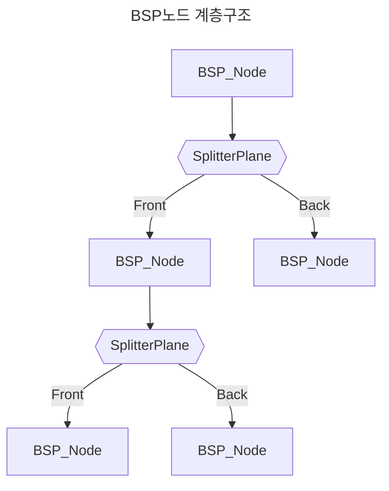
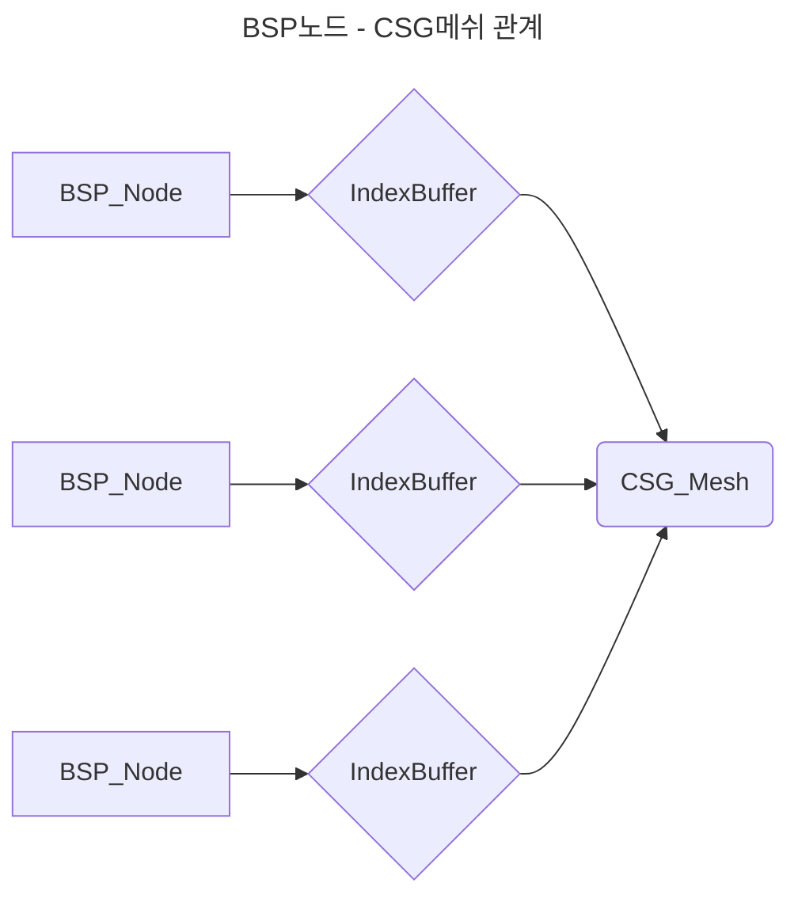

# 코드 설명서

1. [CSG - Mesh Boolean](#1.-csg--mesh-boolean)
2. [Skinned Mesh Cutter](#2.-skinned-mesh-cutter)

## 1. CSG - Mesh Boolean
      

   - 두 메쉬 간의 교집합, 차집합, 합집합 메쉬를 계산하는 기능을 구현   
   - 보로노이 테셀레이션으로 분할한 입방체 공간과 다양한 모양의 메쉬를 교차 연산, non convex 메쉬 분할할 수 있음
   - 메쉬를 구성하는 면에 대해 다른 면들이 정면에 있는지 후면에 있는지를 기준으로 나눈 BSP 트리를 이용해 기능을 구현/최적화 함


### BSP Tree 
- Mesh Boolean을 구현하기 위한 핵심 기술로, 특정 메쉬의 모든 평면에 대한 특정 정점의 상대적 위치를 빠르게 계산하기 위해 이진트리 형태의 자료구조를 선택   
- Mesh의 Facet을 기준으로 Mesh를 이진 트리로 나누어 Facet에 대해 정면/후면 판정을 최적화    
- Torus형태의 non convex하고 복잡한 메쉬에 대해 빠르게 Mesh Boolean을 수행하는 성과를 얻음



- CSG_Mesh : 정점, 노말, UV등 Mesh에 필요한 모든 정보를 담는 구조체([CSG_Data.h](https://github.com/sturdyChair/MeshDestruction/blob/master/Engine/Public/CSG_Data.h))   
- BSP_Node : CSG_Mesh를 통해 구성된 BSP Tree의 Node를 표현([CSG_Data.h](https://github.com/sturdyChair/MeshDestruction/blob/master/Engine/Public/CSG_Data.h))   
- Splitter평면의 Front, Back을 기준으로 Mesh를 이진 트리로 분할   


- 각 노드는 Index 정보만 가지며, Splitter Plane에 포함되는 모든 Face의 Index를 저장함   

```CSG_Manager.cpp

unique_ptr<BSP_Node> CCSG_Manager::BuildBSPTree(CSG_Mesh& mesh, const vector<_uint3>& triangles, const _float3& center)
{
	if (triangles.empty()) return nullptr;
	auto node = make_unique<BSP_Node>();
	const auto& BaseTriangle = triangles[rand() % triangles.size()];
	const auto& v0 = mesh.vertices[BaseTriangle.x], v1 = mesh.vertices[BaseTriangle.y], v2 = mesh.vertices[BaseTriangle.z];
	CSG_Plane plane{ v0,v1,v2 };
	node->Initialize(center, plane, BaseTriangle);
	vector<_uint3> frontTris, backTris;
	for (const auto& tri : triangles){
		if (tri.x == BaseTriangle.x && tri.y == BaseTriangle.y && tri.z == BaseTriangle.z){
			continue;
		}
		PlaneSide side = ClassifyTriangle(mesh, tri, plane);
		switch (side){
		case PlaneSide::Front:
			frontTris.push_back(tri);
			break;
		case PlaneSide::Back:
			backTris.push_back(tri);
			break;
		case PlaneSide::Coplanr:
			node->coplanar.push_back(tri);
			break;
		case PlaneSide::Spanning:{
			vector<_uint3> outFront, outBack;
			ClipTriangleAgainstPlane(mesh, tri, plane, outFront, outBack);
			frontTris.insert(frontTris.end(), outFront.begin(), outFront.end());
			backTris.insert(backTris.end(), outBack.begin(), outBack.end());
		}
		break;
		}
	}
	node->MakePolygon(mesh);
	if(frontTris.size()) node->front = BuildBSPTree(mesh, frontTris, center);
	if(backTris.size()) node->back = BuildBSPTree(mesh, backTris, center);
	return node;
}

```
- BSP_Node 생성 루틴([CSG_Manager.cpp](https://github.com/sturdyChair/MeshDestruction/blob/master/Engine/Private/CSG_Manager.cpp))   

```CSG_Union
void CCSG_Manager::CSG_Union(unique_ptr<BSP_Node>& nodeA, unique_ptr<BSP_Node>& nodeB)
{
	//Clip the meshes against each other			//   _______
	ClipTo(nodeA, nodeB);					//  |   A   |__
	ClipTo(nodeB, nodeA);					//  |____   B  |
	// Invert the second mesh				//       |_____|
	InvertBSPTree(nodeB);					//
	// Clip the inverted mesh against the first one		//
	ClipTo(nodeB, nodeA);					//
	// Revert the second mesh				//
	InvertBSPTree(nodeB);					//

	return;
}
```
- Mesh Union 연산 루틴([CSG_Manager.cpp](https://github.com/sturdyChair/MeshDestruction/blob/master/Engine/Private/CSG_Manager.cpp))   
- 현재 Union, Intersect, Difference 연산을 지원


## 2. Skinned Mesh Cutter

모든 face에 대한 절단 함수 ([MGRR_Cutter.hlsl](https://github.com/sturdyChair/MeshDestruction/blob/master/ShaderFiles/MGRR_Cutter.hlsl))
```MGRR_Cutter.hlsl - main
[numthreads(64, 1, 1)]
void main(uint3 DTid : SV_DispatchThreadID)
{
    uint index = DTid.x, iNumVert, iStride;
    inputVerts.GetDimensions(iNumVert, iStride);
    uint3 tri = indices[index].xyz;
    uint tris[3]; tris[0] = tri.x; tris[1] = tri.y; tris[2] = tri.z;
    Vertex v[3] = { inputVerts[tri.x], inputVerts[tri.y], inputVerts[tri.z] };
    float3 pos[3], norm[3], tang[3];
    float2 uv[3];
    float d[3] ={ 0.f, 0.f, 0.f };
    float4 skinnedPlane[3];
    for (int i = 0; i < 3; ++i){
        float4x4 skinningMatrix = 0;
        float accw = 0.f;
        [unroll]
        for (int j = 0; j < 3; ++j){
            float4x4 bone = Matrices[v[i].blendIndices[j]];
            float w = v[i].blendWeights[j];
            accw += w;
            skinningMatrix += bone * w;
        }
        skinningMatrix += Matrices[v[i].blendIndices[3]] * (1.f - accw);
        d[i] = dot(planeNormal, mul(skinningMatrix, float4(v[i].pos, 1.f)).xyz) + planeD;
        pos[i] = v[i].pos; norm[i] = v[i].normal; tang[i] = v[i].tangent; uv[i] = v[i].uv;
    }
```
- input vertex에 대한 스키닝 적용   
```
    bool side[3], nside[3];
    side[0] = d[0] >= planaEps; side[1] = d[1] >= planaEps; side[2] = d[2] >= planaEps;          // d가 양수라면, 절단면의 법선 방향
    nside[0] = d[0] <= -planaEps; nside[1] = d[1] <= -planaEps; nside[2] = d[2] <= -planaEps;    // d가 음수라면, 절단면의 법선 반대 방향
    bool coplanar[3];
    for (int j = 0; j < 3; ++j){
        coplanar[j] = !side[j] && !nside[j];							 // 양쪽 다 해당하지 않으면 평면 상에 존재
    }
```
- skinned vertex의, 절단면에 대한 상대적 위치 판정
```
    uint up[4], down[4], ucount = 0, dcount = 0;
    for (int k = 0; k < 3; ++k){
        if (side[k]){
            up[ucount] = tris[k];
            ++ucount;
            uint nextIdx = (k + 1) % 3; // 현재 정점(k)과 다음 정점(nextIdx)에 대해
            if (nside[nextIdx]){        // 두 정점이 절단면 기준으로 서로 다른 공간에 위치한다면
		MakeNewVertex(k, nextIdx, ucount, dcount, d, up, down): // 새 정점을 만들고
 		++ucount; ++dcount;	// 위, 아래 모두 정점 추가
            }
        }
        if(nside[k]){ // 반대 방향에 대해서도 마찬가지로 실행
            down[dcount] = tris[k];
            ++dcount;
            uint nextIdx = (k + 1) % 3;
            if (side[nextIdx]){
		MakeNewVertex(k, nextIdx, ucount, dcount, d, down, up):
                ++dcount; ++ucount;
            }
        }
        if (coplanar[k]){ // 평면 상에 있다면 위, 아래 모두 정점 추가
            up[ucount] = tris[k]; ++ucount;
            down[dcount] = tris[k]; ++dcount;
        }
    }
```
- 절단에 의한 정점 생성과 분류
```
    if (ucount == 3){ // 추가된 정점이 3개라면 3개의 정점으로 triangle 구성
        outputVertsUp.Append(uint3(up[0], up[1], up[2]));
    }
    else if(ucount == 4){ // 4개라면 두개의 triangle 구성
        outputVertsUp.Append(uint3(up[0], up[1], up[2]));
        outputVertsUp.Append(uint3(up[0], up[2], up[3]));
    }
    if (dcount == 3){ // 추가된 정점이 3개라면 3개의 정점으로 triangle 구성
        outputVertsDown.Append(uint3(down[0], down[1], down[2]));
    }
    else if (dcount == 4){// 4개라면 두개의 triangle 구성
        outputVertsDown.Append(uint3(down[0], down[1], down[2]));
        outputVertsDown.Append(uint3(down[0], down[2], down[3]));
    }
    return;
}
```
- 새로운 정점들 reindexing, 삼각형 생성
```Make New Vertex
	void MakeNewVertex(int k, int nextIdx, float d[], uint up[], uint down[]){
                Vertex newVert;
                float t = saturate(d[k] / (d[k] - d[nextIdx])); // 두 정점과 평면 사이의 거리를 기준으로 보간 비율 계산	
                newVert = LerpVertex(v[k], v[nextIdx], t);	// 정점 보간						
                newVert.blendIndices = v[k].blendIndices;	// skinning을 위한 bone weight 설정			
                newVert.blendWeights = v[k].blendWeights;
                uint i0 = outputNewVertex.IncrementCounter();	// 정점 추가
                outputNewVertex[i0] = newVert;
                newVert.blendIndices = v[nextIdx].blendIndices; // bone weight 재설정
                newVert.blendWeights = v[nextIdx].blendWeights;
                uint i1 = outputNewVertex.IncrementCounter();   // 정점 추가
                outputNewVertex[i1] = newVert;
                up[ucount] = iNumVert + i0;
                down[dcount] = iNumVert + i1;
	}
```
- 새로운 정점 생성 루틴
