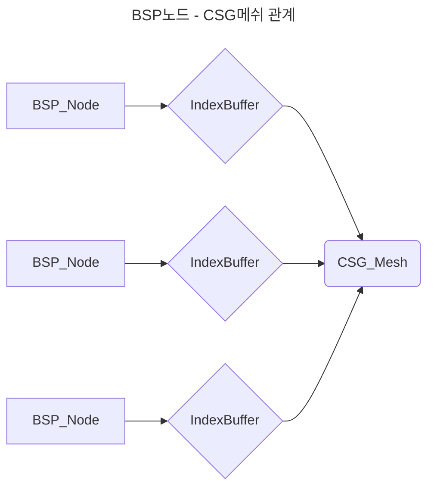

# 코드 설명서

## CSG - Mesh Boolean

```mermaid
메쉬 불리언 연산을 위해 메쉬를 바탕으로 BSP 트리 생성   

```mermaid
---
title: BSP노드 계층구조
---
graph TD
    A[BSP_Node] --> B{{SplliterPlane}}
    B -->|Front| C[BSP_Node]
    B -->|Back| D[BSP_Node]
    C[BSP_Node] --> E{{SplliterPlane}}
    E -->|Front| F[BSP_Node]
    E -->|Back| G[BSP_Node]
```




```CSG_Manager.cpp

unique_ptr<BSP_Node> CCSG_Manager::BuildBSPTree(CSG_Mesh& mesh, const vector<_uint3>& triangles, const _float3& center)
{
	if (triangles.empty()) return nullptr;
	auto node = make_unique<BSP_Node>();
	const auto& BaseTriangle = triangles[rand() % triangles.size()];
	const auto& v0 = mesh.vertices[BaseTriangle.x], v1 = mesh.vertices[BaseTriangle.y], v2 = mesh.vertices[BaseTriangle.z];
	CSG_Plane plane{ v0,v1,v2 };
	node->Initialize(center, plane, BaseTriangle);
	vector<_uint3> frontTris, backTris;
	for (const auto& tri : triangles){
		if (tri.x == BaseTriangle.x && tri.y == BaseTriangle.y && tri.z == BaseTriangle.z){
			continue;
		}
		PlaneSide side = ClassifyTriangle(mesh, tri, plane);
		switch (side){
		case PlaneSide::Front:
			frontTris.push_back(tri);
			break;
		case PlaneSide::Back:
			backTris.push_back(tri);
			break;
		case PlaneSide::Coplanr:
			node->coplanar.push_back(tri);
			break;
		case PlaneSide::Spanning:{
			vector<_uint3> outFront, outBack;
			ClipTriangleAgainstPlane(mesh, tri, plane, outFront, outBack);
			frontTris.insert(frontTris.end(), outFront.begin(), outFront.end());
			backTris.insert(backTris.end(), outBack.begin(), outBack.end());
		}
		break;
		}
	}
	node->MakePolygon(mesh);
	if(frontTris.size()) node->front = BuildBSPTree(mesh, frontTris, center);
	if(backTris.size()) node->back = BuildBSPTree(mesh, backTris, center);
	return node;
}

```
