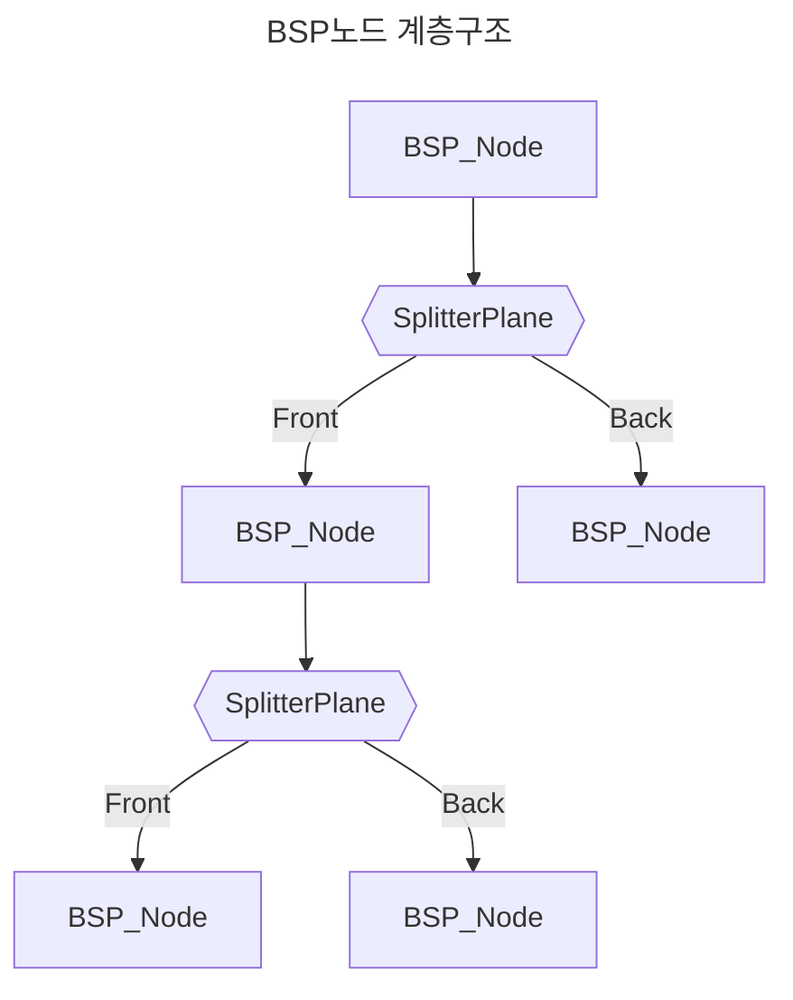
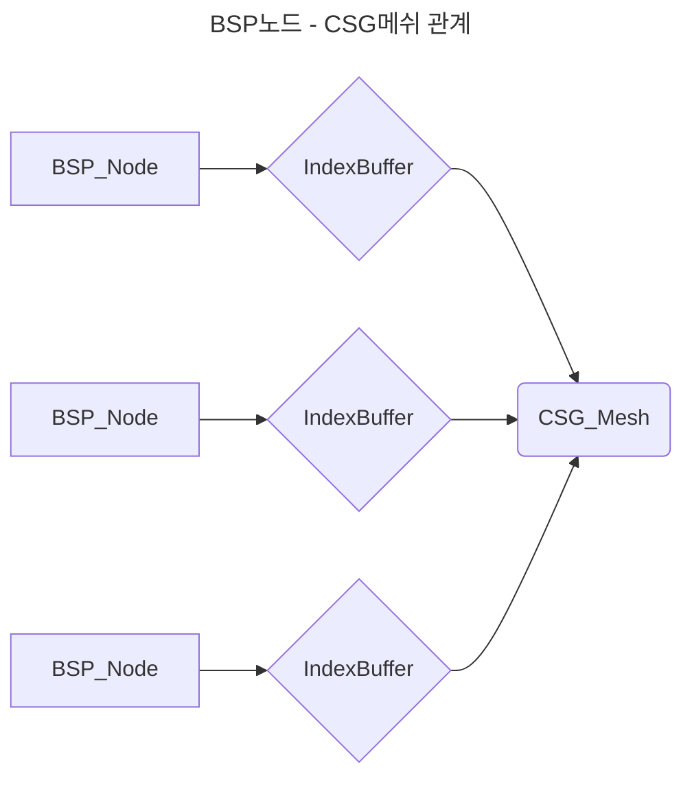

# 코드 설명서

## CSG - Mesh Boolean

### BSP Tree 


>CSG_Mesh : 정점, 노말, UV등 Mesh에 필요한 모든 정보를 담는 구조체([CSG_Data.h](https://github.com/sturdyChair/MeshDestruction/blob/master/Engine/Public/CSG_Data.h))   
>BSP_Node : CSG_Mesh를 통해 구성된 BSP Tree의 Node를 표현([CSG_Data.h](https://github.com/sturdyChair/MeshDestruction/blob/master/Engine/Public/CSG_Data.h))   
>Splitter평면의 Front, Back을 기준으로 Mesh를 이진 트리로 분할   


>각 노드는 Index 정보만 가지며, Splitter Plane에 포함되는 모든 Face의 Index를 저장함   

```CSG_Manager.cpp

unique_ptr<BSP_Node> CCSG_Manager::BuildBSPTree(CSG_Mesh& mesh, const vector<_uint3>& triangles, const _float3& center)
{
	if (triangles.empty()) return nullptr;
	auto node = make_unique<BSP_Node>();
	const auto& BaseTriangle = triangles[rand() % triangles.size()];
	const auto& v0 = mesh.vertices[BaseTriangle.x], v1 = mesh.vertices[BaseTriangle.y], v2 = mesh.vertices[BaseTriangle.z];
	CSG_Plane plane{ v0,v1,v2 };
	node->Initialize(center, plane, BaseTriangle);
	vector<_uint3> frontTris, backTris;
	for (const auto& tri : triangles){
		if (tri.x == BaseTriangle.x && tri.y == BaseTriangle.y && tri.z == BaseTriangle.z){
			continue;
		}
		PlaneSide side = ClassifyTriangle(mesh, tri, plane);
		switch (side){
		case PlaneSide::Front:
			frontTris.push_back(tri);
			break;
		case PlaneSide::Back:
			backTris.push_back(tri);
			break;
		case PlaneSide::Coplanr:
			node->coplanar.push_back(tri);
			break;
		case PlaneSide::Spanning:{
			vector<_uint3> outFront, outBack;
			ClipTriangleAgainstPlane(mesh, tri, plane, outFront, outBack);
			frontTris.insert(frontTris.end(), outFront.begin(), outFront.end());
			backTris.insert(backTris.end(), outBack.begin(), outBack.end());
		}
		break;
		}
	}
	node->MakePolygon(mesh);
	if(frontTris.size()) node->front = BuildBSPTree(mesh, frontTris, center);
	if(backTris.size()) node->back = BuildBSPTree(mesh, backTris, center);
	return node;
}

```
>BSP_Node 생성 루틴([CSG_Manager.cpp](https://github.com/sturdyChair/MeshDestruction/blob/master/Engine/Private/CSG_Manager.cpp))   

```CSG_Union
void CCSG_Manager::CSG_Union(unique_ptr<BSP_Node>& nodeA, unique_ptr<BSP_Node>& nodeB)
{
	//Clip the meshes against each other			//   _______
	ClipTo(nodeA, nodeB);					//  |   A   |__
	ClipTo(nodeB, nodeA);					//  |____   B  |
	// Invert the second mesh				//       |_____|
	InvertBSPTree(nodeB);					//
	// Clip the inverted mesh against the first one		//
	ClipTo(nodeB, nodeA);					//
	// Revert the second mesh				//
	InvertBSPTree(nodeB);					//

	return;
}
```
>Mesh Union 연산 루틴([CSG_Manager.cpp](https://github.com/sturdyChair/MeshDestruction/blob/master/Engine/Private/CSG_Manager.cpp))   
>현제 Union, Intersect, Difference 연산을 지원

